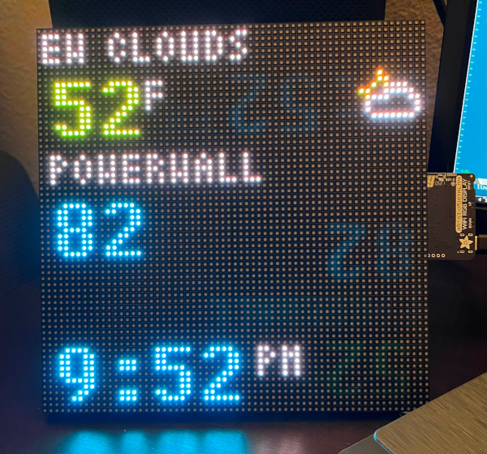

# Matrix Portal Retro-Display (_forked from [Foda/MatrixPortal](https://github.com/Foda/MatrixPortalDisplay)_)

A retro display that shows the time and weather conditions, built on the incredible [Matrix Portal](https://www.adafruit.com/product/4745).

## Time

Time is synced from `http://worldtimeapi.org/api/ip` and uses your IP address to determine the timezone. It syncs on boot, and every 4 hours. Daylight savings (DST) is automatically accounted for.

## Weather

Weather is fetched from `https://api.openweathermap.org`. The weather description will scroll if it doesn't fit, and 6 different icons will be shown for the various type of weather. Weather and temperature is updated every 10 mins.

__You'll need to update `weather_zip` and `weather_app_id` with your own zip code and app id.__

## Powerwall capacity

Displays the powerwall charge capacity via [tesla-gateway-getter](https://github.com/fdawg4l/tesla-gateway-getter).
